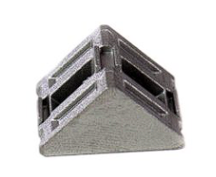
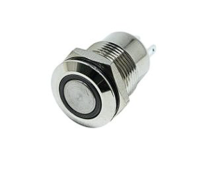
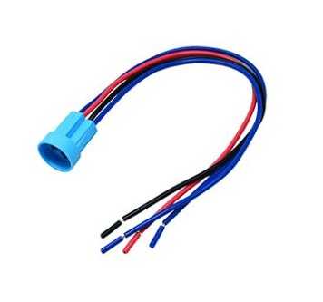
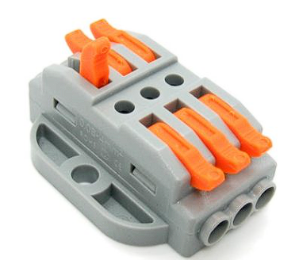
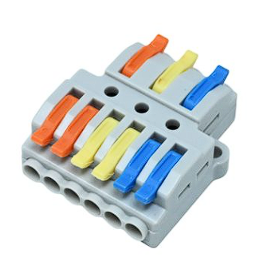
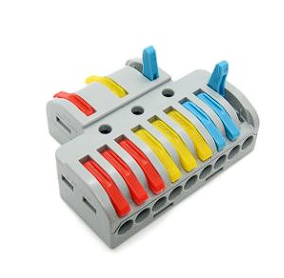

## Introduction to the 2‑Node PX‑Rack BOM

The file **./BOM/2_NODE_BOM.csv** provides a complete bill of materials required to assemble a 2‑Node PX‑Rack enclosure. This BOM covers all mechanical and structural components necessary for construction.
It is important to note that the listed items do not include any electronic components. The enclosure is designed to give you full flexibility in selecting and integrating your own electronics according to project requirements.
By design, the 2‑Node PX‑Rack supports up to two Mini‑ITX motherboards of your choice. This limitation ensures compactness and structural integrity while still allowing customization of the computing hardware.

The file **./BOM/2_NODE_BOM_electronics.csv** provides a complete bill of materials for the electronic components. Please note that this is a sample list based on the configuration I built. Components that can be customized by the user are marked accordingly.

## Part Naming Convention in the Bill of Materials

The part names is the bill of materials follows the following pattern 
1. **3d‑YYYY‑MM‑XXX‑XXXXX‑nnnA:** All part names with this format must be 3D printed.
   1. *YYYY:* The year in which the part design was last modified. 
   2. *MM:* The month in which the part design was last modified. 
   3. *XXX‑XXXX:* Specifies the material information the part should be printed in. 
   4. *nnnA:* A number followed by a letter. All parts that are joined together to form one unit will share the same numerical portion, followed by an incremental alphabet character.
2. **AAAAAAA‑nnnmm:** All parts names with this format must be purchased and cut to length
   1. AAAAAAA: Defines the type of part. 
   2. nnnmm: Length of the part in millimeters. 
3. **AAAAAA‑AAAAA:** All parts names with this format must be purchased.

### Sample Part Links

**L-Clamp**: https://robu.in/product/easymech-cast-corner-bracket-for-20x20-aluminium-profile-silver-4-pcs/

 

**Extrution**:https://robu.in/product/easymech-20x20-t-slot-aluminium-extrusion-profile-1000-mm/

**Mounting T-Nuts**: https://robu.in/product/t-type-m4-nut-for-20x20-aluminium-profile-10-pcs/

**LB12B2-P10F-LANBOO-12mm Economy Push Button Switch**: https://robu.in/product/lb12b2-p10f-lanboo-12mm-economy-push-button-switch-reddc-5-24v1no/ 

**LB12B2-D1-LANBOO-12mm Economy Push Button Switch Connector**: https://robu.in/product/lb12b2-d1-lanboo-12mm-economy-push-button-switch-connectordc-5-24v/

**PCT-223-3 Stationary Type Quick Connection Terminal** : https://robu.in/product/pct-223-3-stationary-type-quick-connection-terminal/

**LT-633(SPL-63) Stationary, Type Quick Connection, Terminal** : https://robu.in/product/lt-633spl-63-stationary-type-quick-connection-terminal/ 

**LT-933(SPL-93) Stationary Type Quick Connection Terminal**: https://robu.in/product/lt-933spl-93-stationary-type-quick-connection-terminal/ 

**IEC C14 Power Inlet Socket with Wires Pre Soldred (Without Fuse)** : https://u1104017.en.made-in-china.com/product/rZBGPcjKlWkD/China-IEC-320-C14-Male-3-Pins-Screw-Mount-Inlet-AC-Power-Plug-Adapter-Connector-Socket-AC-250V-10A-Black-with-Wires.html

