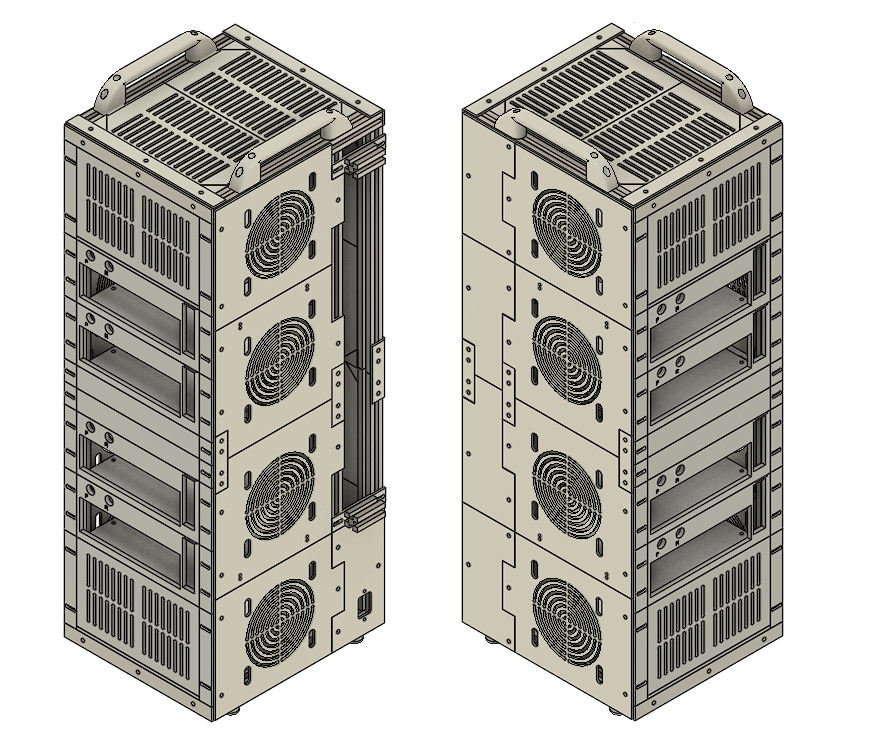
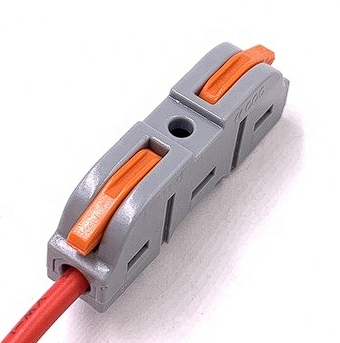
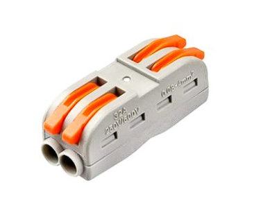
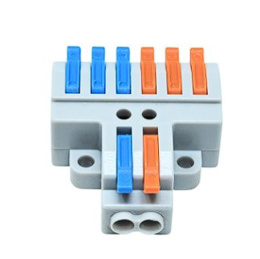

## What is a Px-Rack

Personal Experience Rack, or Px-Rack, is a modular DIY computer rack-style enclosure built for creators who value scalability, customization, and hands-on engineering. Designed to integrate multiple [Mini-ITX](https://en.wikipedia.org/wiki/Mini-ITX) motherboards into a single compact unit, Px-Rack is ideal for homelabs, clustered compute nodes, or multi-OS test environments.

The first use case is [Broadcom VMware Cloud Foundation](https://www.vmware.com/products/cloud-infrastructure/vmware-cloud-foundation). 

### 2-Node Px-Rack Enclosure: ### 


### 4-Node Px-Rack Enclosure: ### 
  


## What sets Px-Rack apart? 

It is Portable, Purpose-Built, and Open-Source

**🔌 Streamlined Power Management**
Unlike traditional racks designed for data centers or server rooms, PX-Rack is purpose-built for commercial hardware. Instead of juggling multiple external power cables, PX-Rack aggregates multiple power supplies into a single external cable using PCT wire connectors.
- No need for extension cords
- No soldering required
- Clean, efficient cable management

**PCT wire connectors:**

 




**📏 Optimized Dimensions**
Width and length — not height — are the critical factors in PX-Rack’s design. This ensures that 10 Gb optical fiber and power cables are neatly tucked inside, reducing clutter and improving accessibility.

**🛠 Maker-Friendly Construction**
Most of PX-Rack’s structural components are 3D-printable, making it accessible and affordable for solo builders and makers.
- STL files available via GitHub
- No proprietary parts
- Community-driven, open-source flexibility

**🌬 Airflow & Multi-Node Freedom**
Whether you’re optimizing airflow, managing cables, or experimenting with multi-node setups, PX-Rack gives you the freedom to build infrastructure your way. It’s a platform designed for experimentation, customization, and scalability.

## Repository stroucture 
```
Px-Rack/
├──2-Node/
│   ├── Data for 2-Node Unit
├──3-Node/   
│   ├── Data for 3-Node Unit
├──4-Node/
│   ├── Data for 4-Node Unit
│
├── STL/
│   ├── ABS/
│   │   ├── PART_001_ABS.stl
│   │   ├── PART_002_ABS.stl
│   │
│   ├── PLA_PETG/
│   │   ├── PART_001_PLA.stl
│   │   ├── PART_002_PLA.stl
└── README.md
    └── Introduction to Px-Rack, build instructions, and licensing.
```
# 📜 Terms and Conditions of Use

By accessing or using the Px-Rack repository, you agree to the following terms:

## 🔧 Personal and Lab Use Only
- This repository is intended solely for **individual, non-commercial use**.
- You may use the provided STL files and documentation to build Px-Rack units for:
  - Personal projects
  - Homelabs
  - Educational setups
  - Non-profit experimentation

## 🚫 Commercial Restrictions
- **Commercial use** of any files, designs, or derivatives is **strictly prohibited** without **explicit written permission** from the repository owner.
- This includes, but is not limited to:
  - Selling printed parts or assembled units
  - Using Px-Rack designs in paid services or commercial installations
  - Distributing modified versions for profit

## 📝 Requesting Permission
- To request commercial usage rights, please contact the repository owner via GitHub or the contact method listed in the main `README.md`.

## 📁 Licensing
- All files are provided "as is" without warranty. Users are responsible for safe printing, assembly, and deployment.
- Redistribution of files must retain original attribution and must not misrepresent the origin or intent of the project.

## 📬 Contact details
- **Name:** Akshay Kalia
- **Email:** akshay@vmzoneblog.com
- **Location:** Bengaluru, Karnataka, India
- **Website:** https://vmzoneblog.com

## FAQs ##

### Why is PDF or STL not loading on Git UI? ###

This behavior is observed when you are connecting to the public GitHub server from a corporate network. Try disabling the VPN and then access the repository.

### What is STL? ###
In 3D printing, STL files are the most common file format used to describe 3D models. STL stands for STereoLithography (or sometimes Standard Triangle Language) and encodes the surface geometry of an object using triangular facets that slicing software can interpret. A slicing software is the tool that converts a 3D model (like an STL file) into layer-by-layer instructions (G-code) that a printer can understand and execute. 

### What is ABS? ###
ABS stands for Acrylonitrile Butadiene Styrene. It is a thermoplastic polymer widely used in 3D printing, especially with FDM (Fused Deposition Modeling) printers. Known for being strong, durable, and impact-resistant, ABS is the same material used in LEGO bricks, car dashboards, and protective housings.

The glass transition temperature of ABS is between 100 and 120 °C. Hence, it is best suited for components operating close to heat-generating parts in the PX-Rack.

### What is PETG? ### 

PETG stands for Polyethylene Terephthalate Glycol-modified. It is a thermoplastic derived from PET (the same plastic used in water bottles), with glycol added to improve durability and reduce brittleness. PETG combines the ease of printing of PLA with the strength and heat resistance of ABS, making it a versatile middle-ground filament.

The glass transition temperature of PETG is between 80 and 100 °C. While it can be used for external parts, it is not suitable for components operating in the vicinity of heat-generating elements in the PX-Rack.

### What is PLA? ###
PLA stands for Polylactic Acid. It is a biodegradable thermoplastic made from renewable resources such as corn starch or sugarcane. PLA is the most widely used filament in desktop 3D printing because it is easy to print, affordable, and environmentally friendly compared to petroleum-based plastics like ABS.

However, the glass transition temperature of PLA lies between 60 and 80 °C. As a result, a large number of PX-Rack components cannot be manufactured using PLA.

PLA should only be used for printing PX-Rack parts as a last resort when printing in PETG is not possible.

